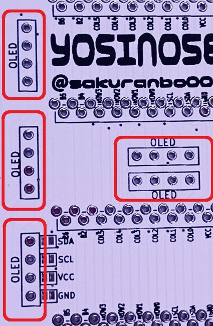

# yosino58 ビルドガイド

## 目次
- [0.事前準備](#0-事前準備)
  - [キットの内容物](#キットの内容物)
  - [キット以外に必要な部品](#キット以外に必要な部品)
  - [オプション品](#オプション品)
  - [必要工具](#必要工具)
- [1.ダイオードのハンダ付け](#1-ダイオードのハンダ付け)
- [Op1.バックライトLEDのハンダ付け](#Op1-バックライトLEDのハンダ付け)
- [2.リセットスイッチ、TRRSジャックのハンダ付け](#2-リセットスイッチTRRSジャックのハンダ付け)
- [Op2.OLEDの取り付け](#Op2-OLEDの取り付け)
- [3.ProMicroのハンダ付け](#3-ProMicroのハンダ付け)
- [Op3.スタビライザーの取り付け](#Op3-スタビライザーの取り付け)
- [4.キースイッチのハンダ付け](#4-キースイッチのハンダ付け)
- [5.LEDテープのハンダ付け](#5-LEDテープのハンダ付け)
- [6.プレートの取り付け](#6-プレートの取り付け)
- [7.ファームウェアの書き込み](#7-QMKファームウェアの書き込み)
  
---

## 0. 事前準備

### キットの内容物

|| 名前 | 数量 | 備考 |
|:---:|---|---:|---|
|1|PCB|2||
|2|トッププレート|2||
|3|ボトムプレート|2||
|4|promicro保護プレート|2||
|5|Pro Micro|2||
|6|表面実装ダイオード|58|＋予備|
|7|TRRSジャック|2||
|8|リセットスイッチ|2||
|9|LEDテープ|3||
|10|M2スペーサー 8mm|10||
|11|M2スペーサー 10mm|4||
|12|M2ねじ 4mm|28||
|13|ゴム足|10||

### キット以外に必要な部品

|| 名前 | 数量 | 備考 |
|:---:|---|---:|---|
|1|キースイッチ|58|CherryMXもしくはKailh Choc|
|2|キーキャップ|58|内2つは2Uの物を推奨|
|3|TRS(3極)ケーブル|1|TRRS(4極)ケーブルでも可|
|4|MicroUSBケーブル|1||

### オプション品

| 名前 | 数量 | 備考 |
:---:|---|---:|---|
|2U用 スタビライザー|2|※Kailh Choc用は未対応|
|コンスルー|4|Promicroの着脱が簡単になる [遊舎工房][1]さんで購入できます|
|SK6812MINI|58|バックライト用|
|OLEDディスプレイ|2|ロゴや状態表示が可能になる|
|OLED用ピンソケット|2|OLEDの着脱が簡単になる|
|BLE Micro Pro|2|無線化できるようになる [のぎけす屋][2]さんで購入できます。 遊舎工房さん実店舗でも販売されています。|
|BLE用電池基盤|2|[のぎけす屋][2]さんで購入できます。 遊舎工房さん実店舗でも販売されています。|
  
  
### 必要工具
- 温調ハンダごて
- ハンダ
- ニッパー
- 精密ドライバー

[1]:https://yushakobo.jp/shop/a01mc-00/
[2]:https://nogikes.booth.pm

---

## 1. ダイオードのハンダ付け
　本キットのPCBはリバーシブルになっています。  
　ビルドガイドではロゴ(yosino58)が表記されている面を表面、桜柄が入っている面を裏面として説明していきます。  
  

　以降は左手用で説明します。右手用はPCBを反転して下さい。

　裏面にダイオードを実装していきます。  
  

　ダイオードには向きがあるので注意してください。線が入っている方が上にくるようにハンダ付してください。  
　※先に一方のパッドにハンダを付けて温めながらダイオードを付けていくと簡単です。  
  

||||
|---|---|---|
  
---

## Op1. バックライトLEDのハンダ付け
　バックライトLED用のチップLEDを実装する際には裏面から実装します。  
　チップLEDの一番大きいパッドがPCBの□で囲っているところになるように実装してください。  
　□が見えにくいところがありますが、すべて同じ向きになっていますので見えるところと合わせてください。  
　温調半田ごてを使い、約220℃ではんだ付けします。温度が高いとLEDが壊れますのでご注意ください。  
  
||||
|---|---|---|

---

## 2. リセットスイッチ、TRRSジャックのハンダ付け
　表面から実装し、裏面をハンダ付けします。  

||||
|---|---|---|

---

## Op2. OLEDの取り付け
　OLEDディスプレイを取り付ける場合は表面の画像の箇所をジャンパしてください。  
  
|||
|---|---|

  
　OLEDディスプレイを取り付ける為のピンソケットを表面から実装し、裏面をハンダ付けします。  
　OLEDディスプレイを取り付ける場合はOLEDという文字がOLEDのピン側に見えるように取り付けます。  
　取り付け箇所は
　128×64ビットのOLEDは真ん中を起点に上、下  
　128×32ビットのOLEDは上、真ん中、下  のいずれかに取り付けてください。  

||||
|---|---|---|

---

## 3. ProMicroのハンダ付け
　ProMicroを上、下いずれかにハンダ付けします。  
　□で囲まれている部分に差し込んでください。またProMicroは部品が実装されている面を下側にしてください。  
　※BLE Micro Pro用に13ピンさせるようになっています。ProMicroの場合一番外側(画像では一番左)は使用しません。  
　※コンスルーを使用する場合はProMicro側をハンダ付けしてください。PCB側のハンダは不要、差し込むだけでOKです。  

|||
|---|---|

　ProMicro側をハンダ付けし、裏返し裏面に出ているピンもハンダ付けします。
　飛び出しているピンはニッパー等で切り落としてください。

---
## Op3. スタビライザーの取り付け
　スタビライザーを取り付ける場合は画像のように表面に取り付けてください。  
　しっかりと装着してください。※私は少し浮いていてアクリルを割りました。

  
  
---

## 4. キースイッチのハンダ付け
　トッププレートにスイッチをはめ、表面に取り付けます。  
　取り付け後裏面のスイッチから出ているピンをハンダ付けします。  
  
||||
|---|---|---|

---

## 5. LEDテープのハンダ付け
　LEDテープを裏面にハンダ付けします。  
　LEDテープの「Din」と書かれているほうをパッドにハンダ付けしてください。  
  
|||
|---|---|

---

## 6. プレートの取り付け
　8mmのスペーサーを画像の箇所に取り付けます。  
　表面のトッププレートからネジを差し込みスペーサーを固定します。
  
|||
|---|---|

　ProMicro保護プレート用のスペーサーを画像の箇所に取り付けます。  
　裏面からネジを差し込み表面にスペーサーを固定します。

|||
|---|---|

　表面からProMicro保護用のプレートをネジで固定します。  
　裏面からボトムプレートを同様にネジで固定します。
  
---

## 7. QMKファームウェアの書き込み

QMKのビルド環境の構築などは[公式ドキュメント][7-1]を参考にするか、他の方のビルドガイドなどを参考にしてください。

yosino58のファームウェアは以下に置いておきます。
https://github.com/sakurachari/qmk_firmware/tree/master/keyboards/yosino58

### キーマップのカスタマイズ
/keymaps/default/を参考にkeymap.cを編集します。
キーコードなどは[ここ][7-2]を参考にしてください。

[7-1]:https://docs.qmk.fm/#/
[7-2]:https://github.com/qmk/qmk_firmware/blob/master/docs/keycodes.md

---
